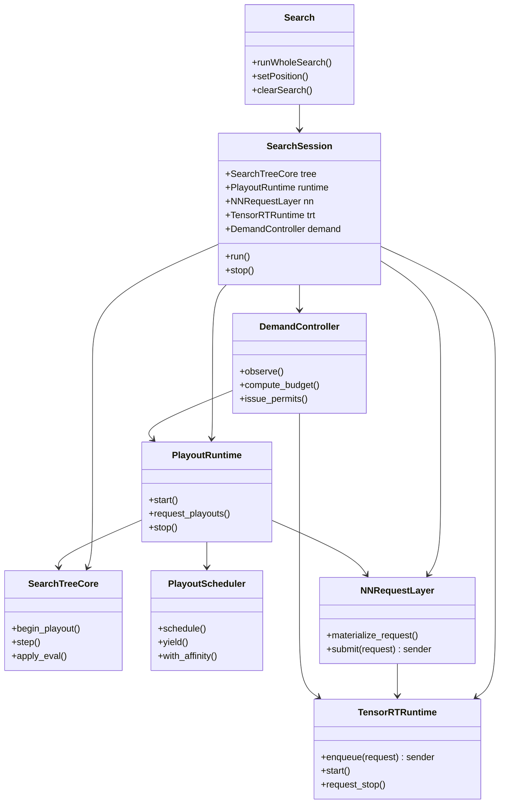
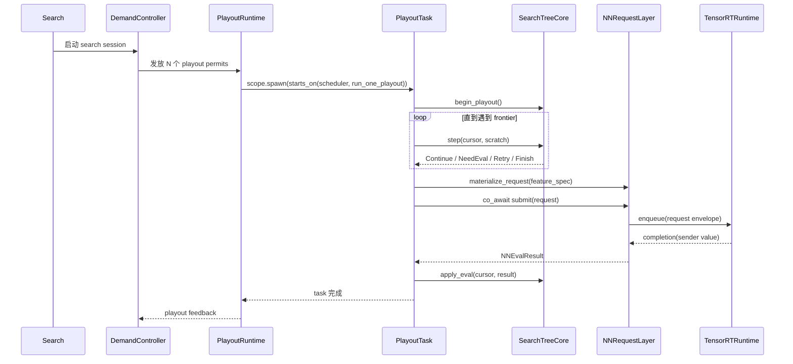
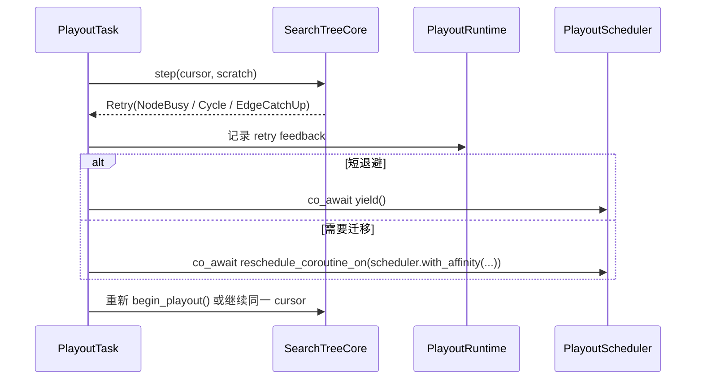
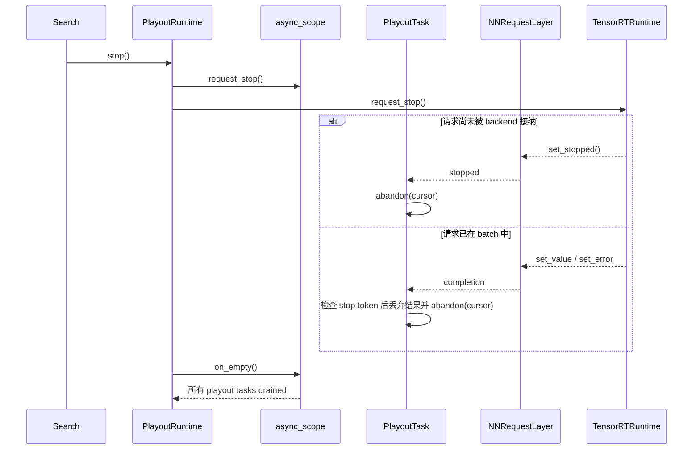

# 计划

本文档在 [v1](./v1.md) 的基础上，把 TensorRT 调度与搜索协程化方案细化到可实现的模块、类图、关键时序和迁移顺序。

## plan_v2

状态：详细设计草案（面向实现）

### 1. 文档目标

`v2` 的目标不是重新讨论方向，而是把 `v1` 的五层结构落成一组可以直接开工的模块文档：

- 顶层文档只回答跨模块问题。
- 每个模块单独成文，覆盖职责、不变量、类图、关键时序、迁移落点和测试方式。
- 所有异步边界都按当前 vendored `stdexec` 的真实语义书写，不引入 callback world 遗留抽象。

### 2. 继承自 v0 / v1 的前提

- 性能优先级仍高于抽象纯洁性。
- TensorRT-only fast path 仍然允许存在。
- `stdexec` 是主机侧异步协议层和组合语言，不是项目搜索 runtime 的替代品。
- 搜索侧与 NN 层的公共边界仍然是 `submit(NNRequest) -> sender<NNEvalResult>`。
- `Receiver` / `OperationState` 只允许出现在 sender 实现内部，不得上升为系统公共抽象。
- `exec::task` 仍按 sticky scheduler 语义使用。
- 如果要显式迁移 coroutine 之后继续运行的 scheduler，仍必须使用 `exec::reschedule_coroutine_on(...)`。

### 3. 文档树

- 顶层总纲：[v2.md](./v2.md)
- 搜索树核心：[v2_search_tree_core.md](./v2_search_tree_core.md)
- playout 运行时：[v2_playout_runtime.md](./v2_playout_runtime.md)
- NN 请求层：[v2_nn_request_layer.md](./v2_nn_request_layer.md)
- TensorRT 运行时：[v2_tensorrt_runtime.md](./v2_tensorrt_runtime.md)
- 需求控制器：[v2_demand_controller.md](./v2_demand_controller.md)

### 4. 顶层模块划分

| 模块 | 主要职责 | 公共边界 | 当前代码锚点 |
| --- | --- | --- | --- |
| `SearchTreeCore` | 树语义、路径推进、virtual loss、图搜索一致性、回填 | 同步值类型 API | `cpp/search/search.cpp`, `cpp/search/searchnode.h`, `cpp/search/searchexplorehelpers.cpp`, `cpp/search/searchupdatehelpers.cpp` |
| `PlayoutRuntime` | `exec::task` 生命周期、CPU 调度、顶层 `async_scope`、stop/yield/migrate | sender/task/scheduler API | `cpp/search/search.cpp`, `cpp/search/searchmultithreadhelpers.cpp`, `cpp/search/asyncbot.cpp` |
| `NNRequestLayer` | 特征物化、请求值类型、cache、sender completion 契约 | `NNRequest`, `NNEvalResult`, `submit()` | `cpp/neuralnet/nneval.cpp`, `cpp/neuralnet/nneval.h`, `cpp/neuralnet/nninputs.cpp` |
| `TensorRTRuntime` | slot/buffer/batch/stream 状态机、H2D/infer/D2H、sender bridge | backend-private, 对外只暴露 sender | `cpp/neuralnet/nneval.cpp`, `cpp/neuralnet/trtbackend.cpp` |
| `DemandController` | 计算目标 in-flight playout / request 库存、发放 permit、控制注入速率 | 控制快照与 budget API | 新模块 |

### 5. 跨模块统一契约

#### 5.1 值类型边界

- `SearchTreeCore` 不返回 sender，不接触 receiver，不持有 scheduler。
- `NNRequest` 是 move-only 值对象，只描述要算什么，不携带 coroutine handle、continuation token 或 receiver。
- `NNEvalResult` 是完成值，至少在第一阶段可继续包装现有 `std::shared_ptr<NNOutput>`，避免一次性重写全部搜索统计代码。
- `FeatureSpec` 只表达“这一叶子需要什么输入与后处理选项”，不表达 backend 细节。

#### 5.2 异步边界约定

- 顶层 playout 注入统一采用：
  - `scope.spawn(stdexec::starts_on(playout_scheduler, run_one_playout(...)))`
- `PlayoutTask` 统一定义为 `exec::task<void>`。
- `NNRequestLayer::submit()` 返回 sender，由 `PlayoutTask` 直接 `co_await`。
- 顶层等待收敛统一采用 `scope.on_empty()`；同步外壳可在需要时 `sync_wait(scope.on_empty())`。

#### 5.3 scheduler 约定

- `PlayoutScheduler` 必须建模 `stdexec::scheduler`。
- scheduler-local 公平让出必须通过 runtime 明确定义的 `yield()` sender，而不是靠调用方自行假设 `schedule(other)` 的迁移效果。
- 显式迁移只允许通过：
  - `exec::reschedule_coroutine_on(playout_scheduler.with_affinity(...))`
- 默认情况下，`PlayoutTask` 在等待 NN completion 之后恢复回原 CPU scheduler。

#### 5.4 stop / error 约定

- 顶层 stop 使用 `exec::async_scope::request_stop()` 传播到所有嵌套任务。
- `submit()` 的 sender 必须读取 stop token。
- 如果 stop 发生在请求被 TensorRT runtime 接纳之前，可以 `set_stopped()`。
- 一旦请求已经进入 backend 的 open batch / launched batch，允许继续完成为 `set_value` 或 `set_error`；上层 task 在恢复后决定是消费结果还是丢弃并 `abandon` cursor。
- 后端异常统一转换为 `std::exception_ptr`，由 sender `set_error()` 传播。

#### 5.5 所有权约定

- open batch 内部 buffer 永远不向搜索层借出。
- `NNRequest` 进入 `submit()` 后，其 host storage 所有权立即转移到 request layer / backend。
- `NNEvalResult` 一旦 publish 即视为只读。
- `PlayoutCursor` 必须是 move-only RAII 对象；若 task 异常退出或 stop，中途持有的 virtual loss 和路径状态由其析构或显式 `abandon()` 释放。

### 6. 顶层对象图

### 7. 顶层关键时序

#### 7.1 正常 playout 到 NN completion

#### 7.2 Retry 与 cooperative yield

#### 7.3 stop 与 drain

### 8. 当前代码到 v2 的映射

| 当前对象 | v2 归属 | 说明 |
| --- | --- | --- |
| `Search` | `Search` facade + `SearchSession` owner | 对外 API 尽量不变，内部拆层 |
| `SearchThread` | `SearchScratch` + `PlayoutTaskContext` | 线程本地状态改成 coroutine task 可复用 scratch |
| `Search::runWholeSearch` | `DemandController + PlayoutRuntime` | 固定线程循环改为需求驱动 permit 注入 |
| `Search::playoutDescend` | `SearchTreeCore::begin_playout / step / apply_eval` | 递归 playout 改为 stepwise 驱动 |
| `NNEvaluator::evaluate` | `NNRequestLayer::materialize_request / submit` | 同步阻塞调用改为 sender completion |
| `SchedulerState` | `TensorRTRuntime` internal graph | 继续 backend-specific，但不穿透到搜索层 |
| `NNResultBuf` | `NNRequestStorage + NNEvalResult + internal completion state` | 请求值对象与 sender 状态拆分 |

### 9. 建议代码落点

为降低重构期间的大规模移动成本，建议新代码先在现有目录内增量引入：

- `cpp/search/searchsession.h/.cpp`
- `cpp/search/searchtreecore.h/.cpp`
- `cpp/search/playoutruntime.h/.cpp`
- `cpp/search/demandcontroller.h/.cpp`
- `cpp/neuralnet/nnrequestlayer.h/.cpp`
- `cpp/neuralnet/tensorrtruntime.h/.cpp`

保留现有：

- `cpp/search/search.h/.cpp` 作为 facade 和迁移壳层
- `cpp/neuralnet/nneval.h/.cpp` 作为临时兼容壳层，逐步把实现搬入新模块

### 10. 分阶段实施顺序

#### Phase A: SearchTreeCore 切边界

- 从 `Search::playoutDescend` 拆出 `PlayoutCursor + SearchScratch + PlayoutStep`。
- 暂不引入 coroutine，先在现有线程模型里跑通 step API。
- 目标是先把树语义和 NN / runtime 解耦。

#### Phase B: NNRequestLayer sender 化

- 引入 `NNRequest` / `NNEvalResult` / `submit()` sender。
- 第一阶段可允许 `NNRequestLayer` 内部桥接到现有 `NNEvaluator`，用于回归正确性。
- 目标是先把 continuation 从请求对象中彻底拿掉。

#### Phase C: TensorRTRuntime 内聚化

- 把 `SchedulerState` 和 TensorRT shared-buffer 状态机从 `NNEvaluator` 中抽出。
- 保持 backend-specific fast path，但 completion 统一回到 sender。
- 目标是收束 slot/buffer/batch 生命周期。

#### Phase D: PlayoutRuntime 协程化

- 引入 `exec::async_scope` 和 `PlayoutScheduler`。
- 顶层改为 one-playout-per-task 注入。
- 初期可先用 `exec::static_thread_pool` 作为 scheduler 后端。

#### Phase E: DemandController 自适应化

- 先上固定 budget policy，保证接口稳定。
- 再切到自适应 demand controller，接入 GPU 未来空闲点和 request 产出率估计。

### 11. 完成定义

`v2` 架构落地完成时，应同时满足：

- 搜索侧不再通过线程身份恢复 NN completion。
- `NNRequest` 不携带 continuation / handle。
- TensorRT 状态机不再从搜索层借用 open batch buffer。
- `PlayoutRuntime` 停止和 drain 可以通过 `async_scope` 明确表达。
- `DemandController` 通过显式 permit 调节 in-flight playout，而不是通过隐式线程数耦合。

