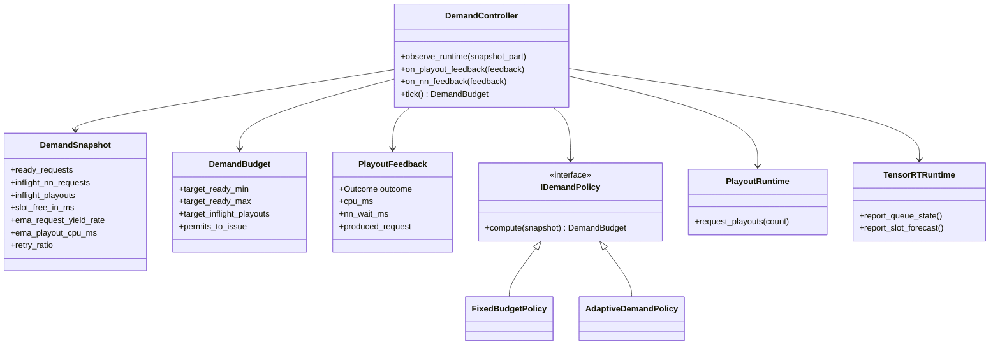
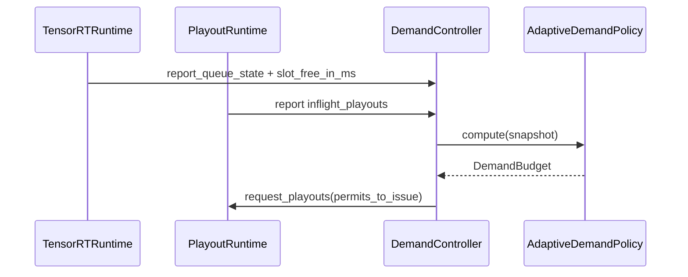
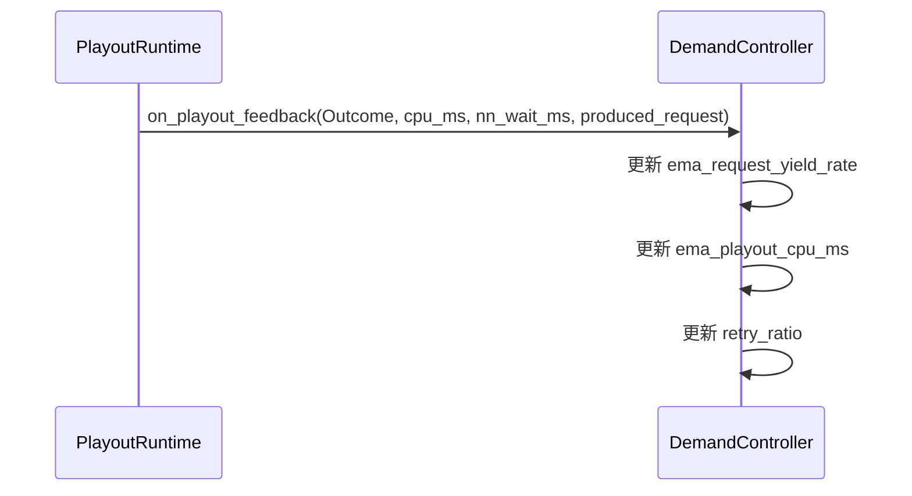
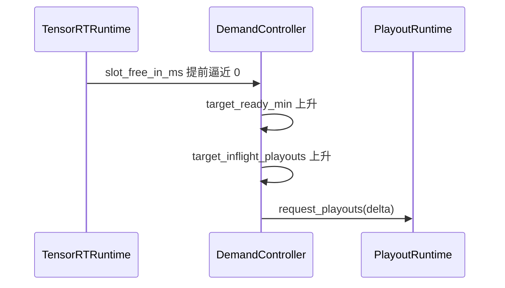
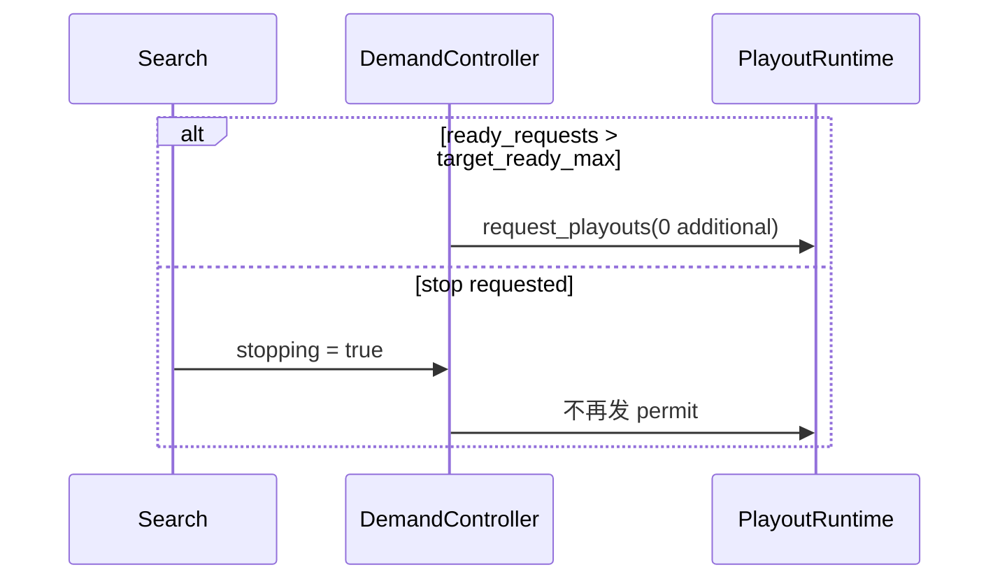

# DemandController

本文档定义 `DemandController` 模块的职责、控制量、类图、关键时序和实施顺序。

## 1. 模块目标

`DemandController` 负责把“GPU 未来需要多少 request”和“CPU 现在应投放多少 playout”连接起来。

它输入的是观测量：

- ready request 数
- in-flight NN request 数
- in-flight playout 数
- 各 device / slot 未来空闲时间
- request 产出率
- playout CPU 成本

它输出的是控制量：

- `target_inflight_playouts`
- `target_ready_min`
- `target_ready_max`
- `permits_to_issue`

它不负责：

- 树语义
- coroutine 生命周期
- TensorRT buffer 管理

## 2. 设计原则

- 控制器不直接“调线程数”。
- 控制器只发 permit，`PlayoutRuntime` 决定如何把 permit 变成 task。
- 控制器必须接受“相当一部分 playout 不产出 NN request”这一事实。
- 控制器先求稳，再求最优；第一阶段允许固定策略实现同一接口。

## 3. 关键类型

### 3.1 `DemandSnapshot`

建议字段：

- `int ready_requests`
- `int inflight_nn_requests`
- `int inflight_playouts`
- `int running_playout_tasks`
- `std::vector<double> slot_free_in_ms`
- `double ema_request_yield_rate`
- `double ema_playout_cpu_ms`
- `double ema_nn_latency_ms`
- `double retry_ratio`
- `bool stopping`

### 3.2 `DemandBudget`

建议字段：

- `int target_ready_min`
- `int target_ready_max`
- `int target_inflight_playouts`
- `int permits_to_issue`

### 3.3 `PlayoutFeedback`

建议字段：

- `enum class Outcome { NeedEval, Retry, Finish, Abandon }`
- `double cpu_ms`
- `double nn_wait_ms`
- `bool produced_request`

### 3.4 `IDemandPolicy`

建议抽象：

```text
struct IDemandPolicy {
  virtual DemandBudget compute(const DemandSnapshot&) = 0;
};
```

两种实现：

- `FixedBudgetPolicy`
- `AdaptiveDemandPolicy`

## 4. 类图



## 5. 控制量定义

### 5.1 目标 request 库存区间

定义：

- `target_ready_min`
  - 在控制 horizon 内，理论上至少应准备好的 request 数
- `target_ready_max`
  - 允许的库存上界，超过后暂停发 permit

建议初始公式：

```text
horizon_ms = max(ema_nn_latency_ms, min_horizon_ms)
slots_soon_free = count(slot_free_in_ms <= horizon_ms)
target_ready_min = slots_soon_free * preferred_batch_size
target_ready_max = target_ready_min + slack_batches * preferred_batch_size
```

### 5.2 目标 in-flight playout

定义：

```text
effective_request_supply = ready_requests + inflight_nn_requests
missing_requests = max(0, target_ready_min - effective_request_supply)
yield_rate = max(ema_request_yield_rate, min_yield_floor)
target_inflight_playouts = ceil(missing_requests / yield_rate)
```

然后再做 clamp：

- 不小于 `min_inflight_playouts`
- 不大于 `max_inflight_playouts`

### 5.3 permit 发放

```text
permits_to_issue = max(0, target_inflight_playouts - inflight_playouts)
```

如果：

- `effective_request_supply >= target_ready_max`
- 或 `stopping == true`

则：

- `permits_to_issue = 0`

## 6. 关键时序

### 6.1 周期性 tick



### 6.2 playout feedback 更新 EMA



### 6.3 GPU 即将缺料



### 6.4 oversupply 与 stop



## 7. 策略实现

### 7.1 `FixedBudgetPolicy`

这是 MVP 策略，只有固定参数：

- `fixed_target_inflight_playouts`
- `fixed_target_ready_min`
- `fixed_target_ready_max`

用途：

- 在接口稳定之前先验证 runtime 正确性
- 作为回归基线

### 7.2 `AdaptiveDemandPolicy`

这是长期策略，输入实时观测量，至少维护以下 EMA：

- `ema_request_yield_rate`
  - 已产出 request 的 playout / 总 playout
- `ema_playout_cpu_ms`
- `ema_nn_latency_ms`
- `retry_ratio`

可选增强：

- 按根节点热点或 GPU 区分分桶
- 按 board size / rules / ownership 需求分桶

## 8. 不变量

### 8.1 permit 语义

- permit 只表示“允许启动一个新的 playout 尝试”。
- permit 不是线程占用权，也不是 worker pin。

### 8.2 观测闭环

- 控制器不能凭空假设 yield rate。
- 所有目标量都必须能追溯到当前 runtime 与 backend 观测值。

### 8.3 可退化运行

- 如果 `AdaptiveDemandPolicy` 出错或未完成实现，系统可以退化到 `FixedBudgetPolicy`。
- `PlayoutRuntime` 不应依赖某个特定控制算法。

## 9. 与当前代码的映射

当前代码没有独立的 `DemandController`，相关行为分散在：

- `Search::runWholeSearch()` 中固定线程数 + 时间限制循环
- `NNEvaluator` 的 batch / scheduler 自然背压

`v2` 要把这些隐式控制改成显式控制：

- 时间停止条件仍由上层 `Search` / `TimeControls` 管理
- request 库存和 playout 注入则归 `DemandController`

## 10. 实施顺序

### 10.1 第一步

- 先实现 `FixedBudgetPolicy`
- 打通：
  - `DemandSnapshot`
  - `DemandBudget`
  - `request_playouts(permits_to_issue)`

### 10.2 第二步

- 接入：
  - `ready_requests`
  - `inflight_nn_requests`
  - `slot_free_in_ms`
  - `PlayoutFeedback`

### 10.3 第三步

- 上 `AdaptiveDemandPolicy`
- 调参并建立观测面板：
  - request yield rate
  - permit issuance rate
  - GPU starvation ratio
  - oversupply ratio

## 11. 测试与验证

- `FixedBudgetPolicy` 单元测试
- `AdaptiveDemandPolicy` 公式测试
- 高 retry ratio 下 permits 能否自动抬升
- oversupply 时 permits 是否归零
- stop 时不再发 permit
- 与 benchmark 联动验证：
  - GPU starvation 降低
  - ready queue 不持续空也不过度膨胀

