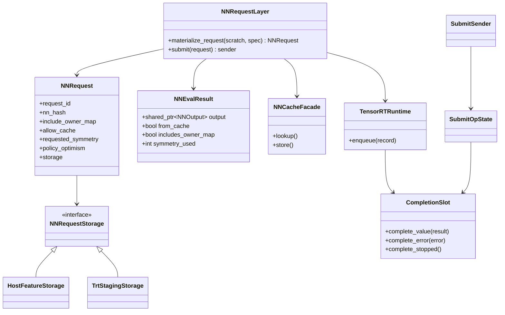
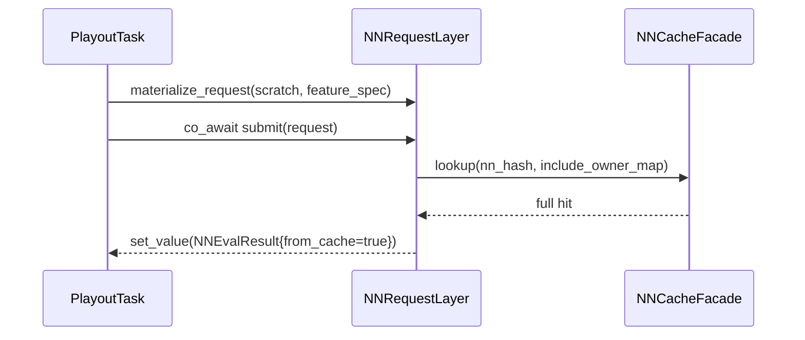
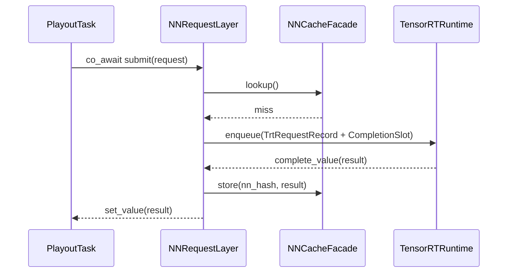
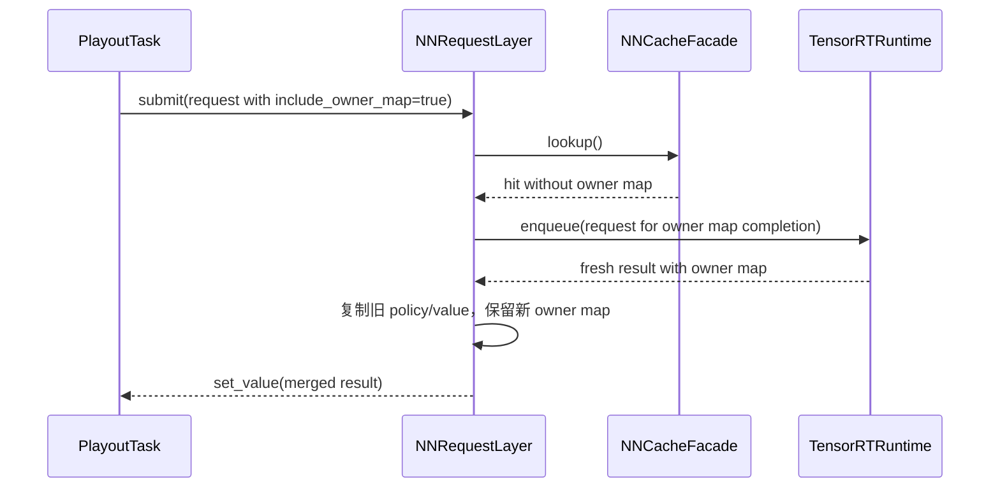
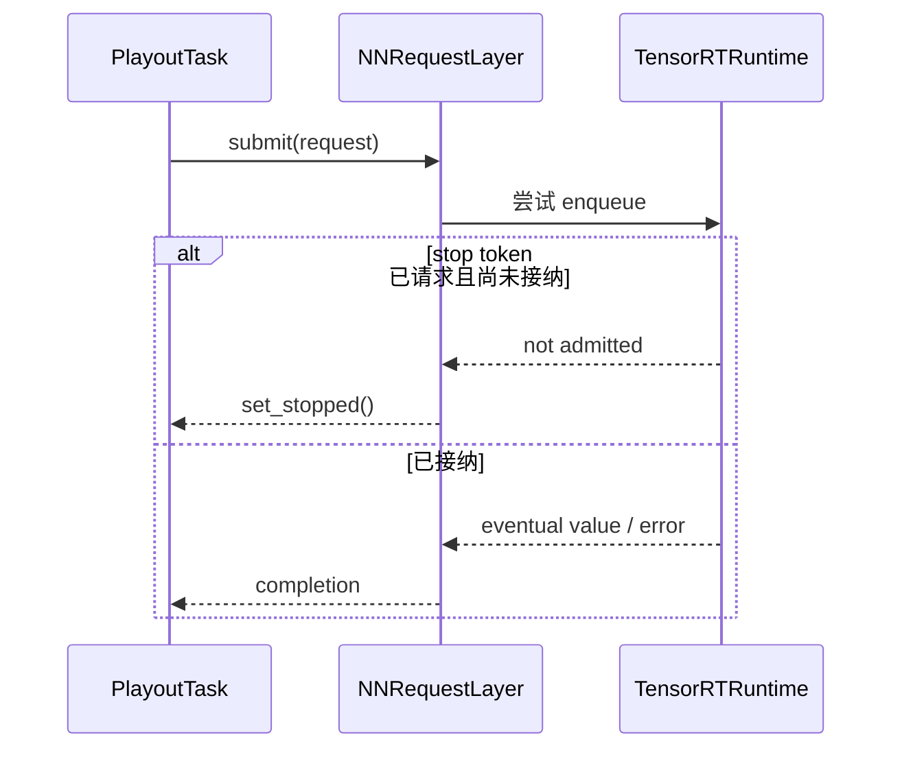

# NNRequestLayer

本文档定义 `NNRequestLayer` 模块的职责、值类型、sender 契约、类图、关键时序和迁移顺序。

## 1. 模块目标

`NNRequestLayer` 是搜索侧与后端之间的协议层，负责：

- 特征物化
- `NNRequest` 值对象定义
- `NNEvalResult` 完成值定义
- cache 查询与写回
- `submit(NNRequest) -> sender` 的公共异步边界
- 把 backend completion 翻译回 sender completion

它不负责：

- 搜索树推进
- playout coroutine 生命周期
- TensorRT slot / batch 调度细节

当前代码锚点：

- `cpp/neuralnet/nneval.h`
- `cpp/neuralnet/nneval.cpp`
- `cpp/neuralnet/nninputs.h`
- `cpp/neuralnet/nninputs.cpp`
- `cpp/neuralnet/nninterface.h`

## 2. 边界与非目标

### 2.1 公共边界

公共 API 只应暴露：

- `NNRequest`
- `NNEvalResult`
- `materialize_request(...)`
- `submit(NNRequest) -> sender`

### 2.2 非目标

- 不把 `NNResultBuf` 原封不动搬过来作为新请求类型。
- 不把 continuation / coroutine handle / receiver 嵌入请求对象。
- 不把 TensorRT buffer 指针暴露给搜索侧。
- 不要求非 TensorRT backend 在第一阶段完全跟进相同优化路径。

## 3. 关键类型

### 3.1 `NNRequestStorage`

`NNRequestStorage` 是请求持有 host 侧输入数据的抽象，建议为 move-only 对象。

推荐形态：

```text
struct NNRequestStorage {
  span<float> spatial;
  span<float> global;
  span<float> meta;
  bool has_meta;
};
```

实现可以有两类：

- `HostFeatureStorage`
  - 通用、易验证
- `TrtStagingStorage`
  - TensorRT fast path 专用，允许布局更接近最终 staging / row pack 格式

约束：

- 搜索层只能看到值语义，不知道底层分配策略。
- storage 进入 `submit()` 后所有权立即转移。

### 3.2 `NNRequest`

建议字段：

- `uint64_t request_id`
- `Hash128 nn_hash`
- `FeatureSpec feature_spec`
- `NNRequestStorage storage`
- `bool include_owner_map`
- `bool allow_cache`
- `int requested_symmetry`
- `float policy_optimism`

明确禁止的字段：

- `std::coroutine_handle<>`
- `Receiver*`
- `OperationState*`
- `SearchThread*`
- `PlayoutCursor*`

### 3.3 `NNEvalResult`

第一阶段建议尽量兼容现有搜索代码：

- `std::shared_ptr<NNOutput> output`
- `bool from_cache`
- `bool includes_owner_map`
- `int symmetry_used`
- `double queue_wait_ms`
- `double backend_latency_ms`

这样可以：

- 减少 `SearchTreeCore` 的首轮迁移成本
- 保持 `NNOutput` 后处理和统计代码基本不动

### 3.4 `NNRequestLayer`

建议公共接口：

```text
class NNRequestLayer {
 public:
  NNRequest materialize_request(const SearchScratch&, const FeatureSpec&) const;
  sender auto submit(NNRequest request);
};
```

### 3.5 `NNCacheFacade`

cache 语义从 `NNEvaluator` 中抽出，建议独立成内部组件：

- `lookup(nn_hash, include_owner_map)`
- `store(nn_hash, result)`

保留当前特殊语义：

- 如果 cache 命中但缺 owner map，而调用方要求 owner map：
  - 仍然向 backend 发请求
  - 完成后复制旧 policy/value，使用新 owner map

### 3.6 `SubmitSender` 与 `SubmitOpState`

sender 实现内部允许存在：

- `SubmitSender`
- `SubmitOpState`
- `CompletionSlot`

但这些都属于 `NNRequestLayer` 私有实现细节，不得向外提升为系统公共抽象。

## 4. 类图



## 5. sender 契约

### 5.1 completion signatures

`submit(request)` 必须表达三类完成：

- `set_value(NNEvalResult)`
- `set_error(std::exception_ptr)`
- `set_stopped()`

### 5.2 stop 语义

- 如果 stop 发生在 backend 接纳请求之前，允许 `set_stopped()`。
- 如果请求已经进入 backend 的 open batch / launched batch，则允许继续完成为 `set_value` 或 `set_error`。
- 调用方在恢复后自行决定是否消费结果。

### 5.3 对称性与默认值

为保持与当前实现兼容，`requested_symmetry` 允许保留：

- `NNInputs::SYMMETRY_NOTSPECIFIED`

此时实际 symmetry 的解析时机可以在：

- cache lookup 之后
- backend 接纳之前

这样能保留当前“缓存键与最终随机对称变换解耦”的行为。

## 6. 关键时序

### 6.1 cache hit



### 6.2 cache miss 到 backend completion



### 6.3 partial cache hit only missing owner map



### 6.4 stop before backend admission



## 7. 不变量

### 7.1 请求与 coroutine 解耦

- `NNRequest` 只描述输入，不描述“完成后跳回哪里”。
- `SubmitOpState` 自己持有 receiver 与 stop token。
- `TensorRTRuntime` 只看得到内部 completion adapter，而不是 task handle。

### 7.2 所有权

- `materialize_request()` 结束后，特征数据完全属于 `NNRequest`。
- `submit()` 接受请求后，原调用方不再持有 storage。
- backend 永远不能要求搜索层借出 `SearchScratch` 的内部缓冲。

### 7.3 cache 语义

- cache 命中只能在请求被 backend 接纳之前短路。
- cache 写回发生在结果已经后处理完成之后。
- partial cache hit 的兼容逻辑必须被单元测试覆盖。

## 8. 与当前代码的映射

| 当前对象 / 逻辑 | v2 归属 |
| --- | --- |
| `NNResultBuf::rowSpatialBuf / rowGlobalBuf / rowMetaBuf` | `NNRequestStorage` |
| `NNEvaluator::evaluate()` 前半段 fill row 逻辑 | `materialize_request()` |
| `NNCacheTable` | `NNCacheFacade` |
| `NNResultBuf::result + hasResult + condvar` | `SubmitOpState + CompletionSlot` |
| `NNOutput` | `NNEvalResult::output` |

## 9. 实施顺序

### 9.1 第一步

- 先引入 `NNRequest` / `NNEvalResult` / `NNRequestStorage`。
- `materialize_request()` 直接复用现有 `NNInputs::fillRowVx()`。

### 9.2 第二步

- 引入 `SubmitSender` / `SubmitOpState`。
- 第一阶段允许 `submit()` 内部桥接到现有 `NNEvaluator` 或 legacy adapter，以快速打通 sender 语义。

### 9.3 第三步

- 把 backend 路径切到 `TensorRTRuntime`。
- 之后 `NNEvaluator` 只保留兼容 facade 或被完全替换。

## 10. 测试与验证

- `materialize_request()` 输出和旧 `NNResultBuf` 逐字段比对
- cache full hit / partial hit / miss 路径
- `submit()` 的三类 completion
- stop-before-admission 行为
- `NNEvalResult` 与旧路径数值回归

