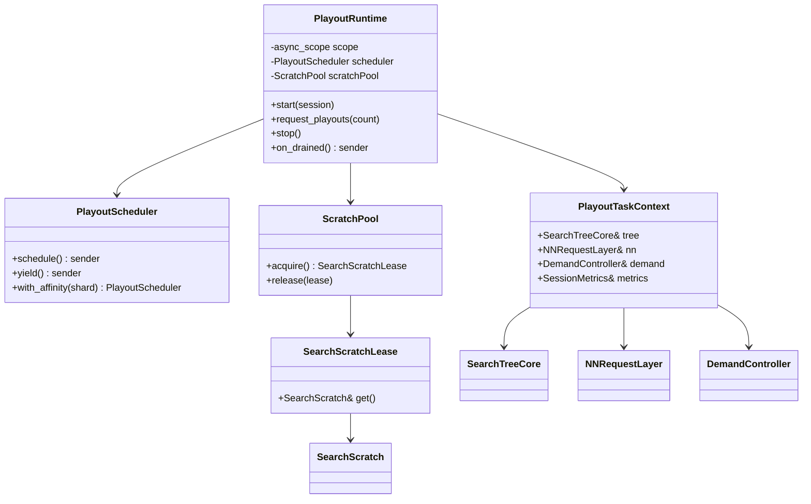
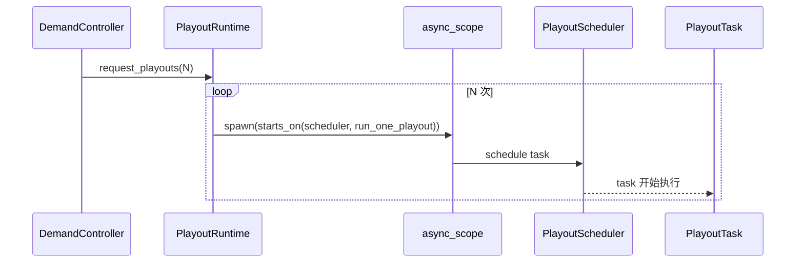
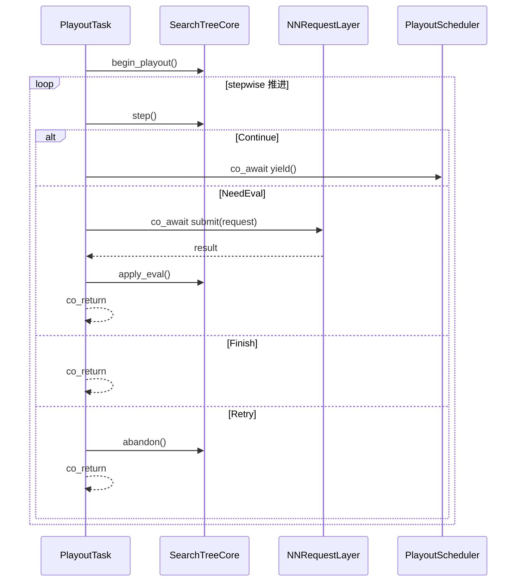
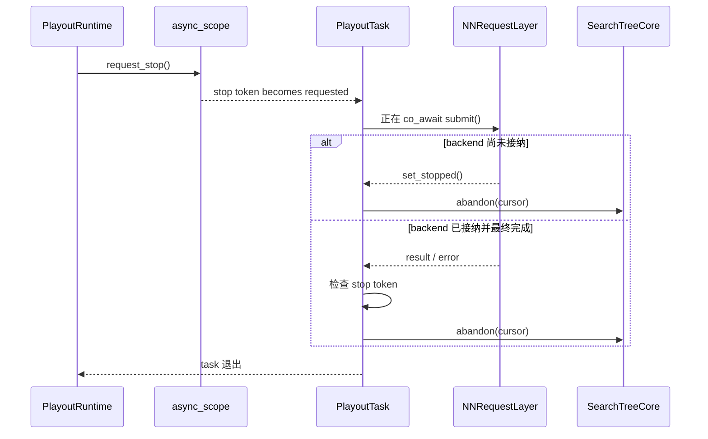
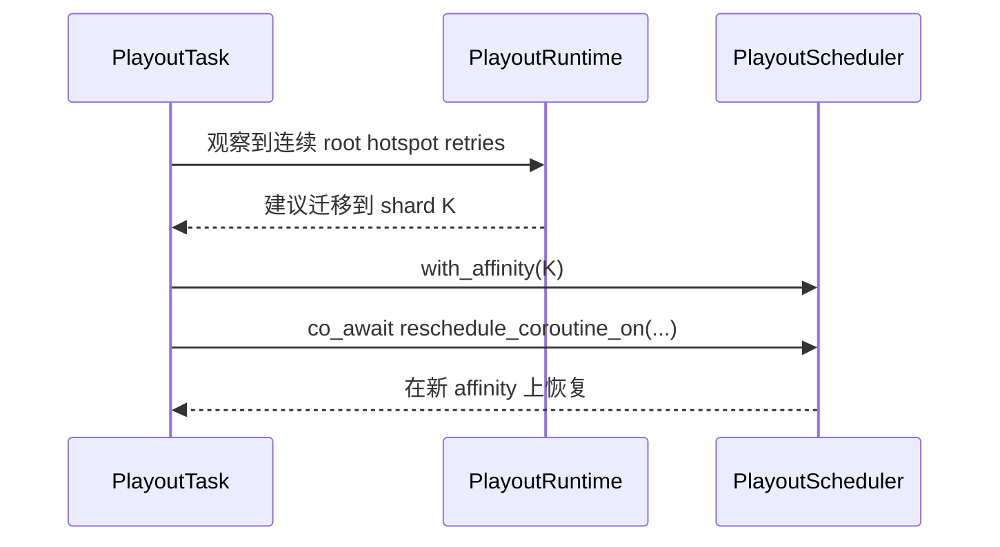

# PlayoutRuntime

本文档定义 `PlayoutRuntime` 模块的职责、stdexec 使用方式、类图、关键时序和迁移顺序。

## 1. 模块目标

`PlayoutRuntime` 是搜索协程运行时本体，负责：

- 顶层 playout 注入
- `exec::task` 生命周期
- `exec::async_scope` 管理
- CPU scheduler / worker 绑定
- cooperative yield
- 显式 migration
- stop / drain
- 向 `DemandController` 回报 playout 反馈

它不负责：

- 树语义
- NN 特征物化
- TensorRT slot / buffer / batch

当前代码锚点：

- `cpp/search/search.cpp` 中的搜索主循环
- `cpp/search/searchmultithreadhelpers.cpp`
- `cpp/search/asyncbot.cpp`

## 2. 与 stdexec 的关系

### 2.1 使用原则

- 顶层 playout 以 `exec::task<void>` 表示。
- 任务注入使用 `exec::async_scope::spawn(...)`。
- 搜索任务的 stop token 来自 `exec::async_scope`。
- `NNRequestLayer::submit()` 返回 sender，`PlayoutTask` 直接 `co_await`。

### 2.2 明确禁止的写法

- 不把 receiver / operation state 暴露成 runtime 公共类。
- 不把 `co_await schedule(other_scheduler)` 当成“迁移当前 coroutine”的统一手段。
- 不把 `exec::static_thread_pool` 直接当长期架构本身。

### 2.3 明确允许的写法

- 顶层注入：
  - `scope.spawn(stdexec::starts_on(playout_scheduler, run_one_playout(...)))`
- scheduler-local 公平让出：
  - `co_await playout_scheduler.yield()`
- 显式迁移：
  - `co_await exec::reschedule_coroutine_on(playout_scheduler.with_affinity(...))`

## 3. 核心对象

### 3.1 `PlayoutRuntime`

建议职责：

- 持有 `exec::async_scope`
- 持有 `PlayoutScheduler`
- 管理 in-flight playout 计数
- 响应 `DemandController` 的 permit 发放
- 启动 / 停止 search session

### 3.2 `PlayoutScheduler`

建议定义为项目自己的 scheduler 类型，但建模 `stdexec::scheduler`。

Phase 1 可以：

- 内部包装 `exec::static_thread_pool`
- 提供 `schedule()`
- 提供 `yield()`
- 提供 `with_affinity(shard_id)`

长期则替换为项目自己的 worker / queue / affinity 模型，而不改调用方协议。

### 3.3 `PlayoutTaskContext`

每个 `PlayoutTask` 的只读/共享上下文，建议包含：

- `SearchTreeCore&`
- `NNRequestLayer&`
- `DemandController&`
- `PlayoutRuntimeMetrics&`
- `SearchSessionSharedState&`

它不持有：

- 自己的路径状态
- 自己的 host feature buffer

这些可变状态由 `SearchScratch` 和 `PlayoutCursor` 持有。

### 3.4 `ScratchPool`

为了避免每个 task 分配一次大块 scratch，runtime 应提供：

- `ScratchPool`
- `SearchScratchLease`

任务开始时借入，结束时归还。

### 3.5 `PlayoutFeedback`

runtime 需要统一上报以下反馈给控制器：

- `NeedEval` 命中次数
- `Retry` 次数及原因
- 完成 playout 数
- `abandon()` 数
- 单次 playout CPU 时间
- NN 等待时间

## 4. 公共接口草案

```text
class PlayoutRuntime {
 public:
  void start(SearchSessionSharedState& session);
  void request_playouts(int count);
  void stop();
  sender auto on_drained();
};
```

```text
class PlayoutScheduler {
 public:
  sender auto schedule() const;
  sender auto yield() const;
  PlayoutScheduler with_affinity(int shard) const;
};
```

```text
exec::task<void> run_one_playout(PlayoutTaskContext ctx);
```

契约：

- `start()` 初始化 scope、scheduler 和 scratch pool。
- `request_playouts(count)` 表示“再注入 count 个 playout task”，不是设置线程数。
- `stop()` 调用 `scope.request_stop()`，并停止继续发放新的 permit。
- `on_drained()` 由 `scope.on_empty()` 驱动，用于外层同步或测试等待。

## 5. 类图



## 6. `run_one_playout()` 推荐流程

```text
exec::task<void> run_one_playout(PlayoutTaskContext ctx) {
  auto lease = ctx.scratchPool.acquire();
  auto& scratch = lease.get();
  auto cursor = ctx.tree.begin_playout(scratch);

  while(true) {
    if (stop requested) {
      ctx.tree.abandon(cursor, scratch);
      co_return;
    }

    switch (ctx.tree.step(cursor, scratch)) {
      case Continue:
        co_await ctx.scheduler.yield();
        break;
      case Retry:
        ctx.tree.abandon(cursor, scratch);
        co_return;
      case Finish:
        co_return;
      case NeedEval:
        NNRequest req = ctx.nn.materialize_request(scratch, featureSpec);
        NNEvalResult result = co_await ctx.nn.submit(std::move(req));
        if (stop requested after resume) {
          ctx.tree.abandon(cursor, scratch);
          co_return;
        }
        ctx.tree.apply_eval(cursor, scratch, std::move(result));
        co_return;
    }
  }
}
```

这个流程的重点是：

- 搜索树推进、NN 等待、回填都在同一个 coroutine 中表达。
- continuation 不通过请求对象存储。
- scheduler 恢复语义由 `exec::task` 和 sender await 规则承担。

## 7. 关键时序

### 7.1 permit 发放到 task 注入



### 7.2 正常 playout



### 7.3 stop 发生在等待 NN 期间



### 7.4 显式迁移



## 8. 不变量

### 8.1 任务粒度

- 一个 `PlayoutTask` 只负责一次 playout 尝试。
- 一个任务完成后直接退出，不在任务内部无界循环消费 permit。

这样可以让：

- `async_scope` 精确统计 in-flight playout 数
- stop / drain 语义简单
- `DemandController` 直接以 task 数表达并发度

### 8.2 scheduler 语义

- 默认恢复位置依赖 `exec::task` sticky 语义。
- 不允许任何调用方根据“哪个 OS 线程恢复了”来决定后续逻辑。
- 任何需要 worker 迁移的地方都必须显式写在代码里。

### 8.3 stop 语义

- `stop()` 只停止新任务注入并请求现有任务收敛。
- 不要求强杀已经进入 GPU 的请求。
- 任何 stop 路径都必须保证：
  - cursor 被安全 abandon
  - scratch 被归还
  - task 可被 `scope.on_empty()` 观察到结束

## 9. 与当前代码的映射

| 当前逻辑 | v2 归属 |
| --- | --- |
| `Search::runWholeSearch()` 的线程主循环 | `PlayoutRuntime::request_playouts()` + task 注入 |
| `performTaskWithThreads()` | `PlayoutScheduler` 内部实现 |
| `shouldStopNow` | `async_scope` stop token |
| `std::this_thread::yield()` | `co_await playout_scheduler.yield()` |
| `SearchThread` 的构造/销毁 | `ScratchPool` lease 管理 |

## 10. 实施顺序

### 10.1 MVP

- `PlayoutScheduler` 先包装 `exec::static_thread_pool`
- `PlayoutRuntime` 只支持：
  - `start()`
  - `request_playouts()`
  - `stop()`
  - `on_drained()`
- `DemandController` 先用固定 budget policy

### 10.2 第二阶段

- 增加 `with_affinity()`
- 增加 runtime-level `yield()` sender
- 在 Retry 热点路径上加入迁移策略

### 10.3 第三阶段

- 自定义调度器替换 `static_thread_pool`
- 接入 NUMA / core pinning / 本地队列 / work stealing

## 11. 测试与验证

- 任务 stop/drain 测试：
  - `request_stop()` 后所有 task 都会结束
  - `scope.on_empty()` 可完成
- 恢复语义测试：
  - `co_await submit()` 后回到 playout scheduler
- Retry / yield 测试：
  - 不发生 busy-spin
- 迁移测试：
  - `reschedule_coroutine_on()` 后后续 `step()` 在新 affinity 上继续
- 压测观测：
  - in-flight playout
  - task 创建/完成速率
  - 平均等待 NN 时间
  - abandon 比例

