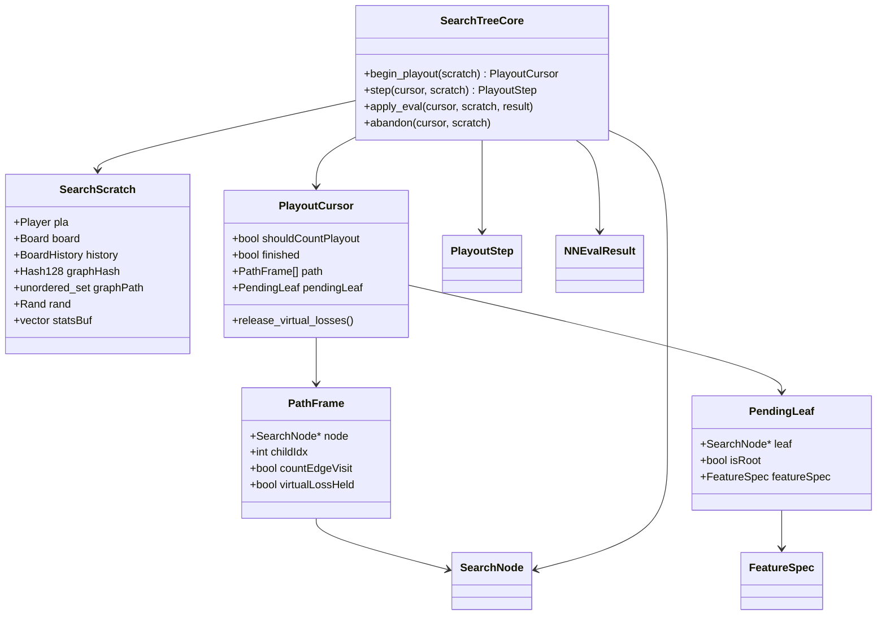
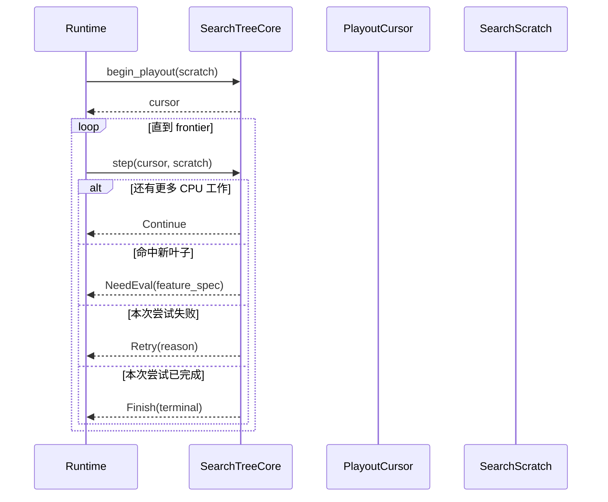
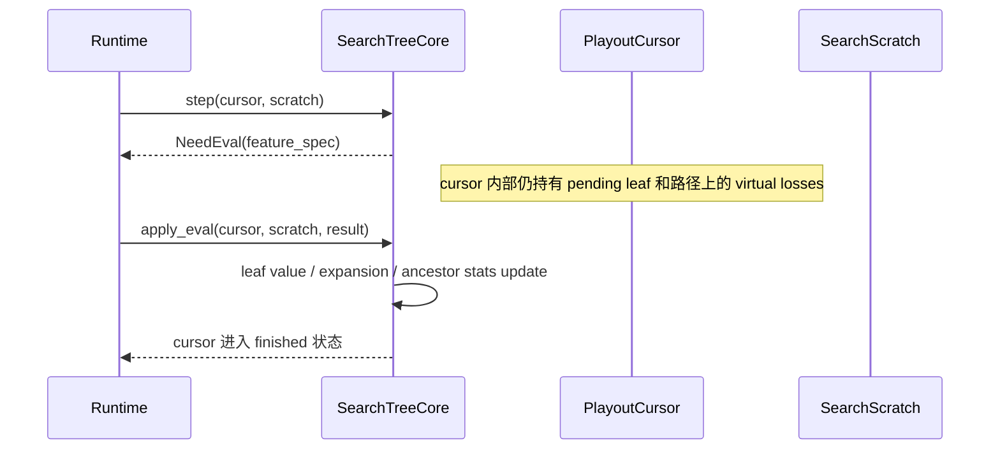
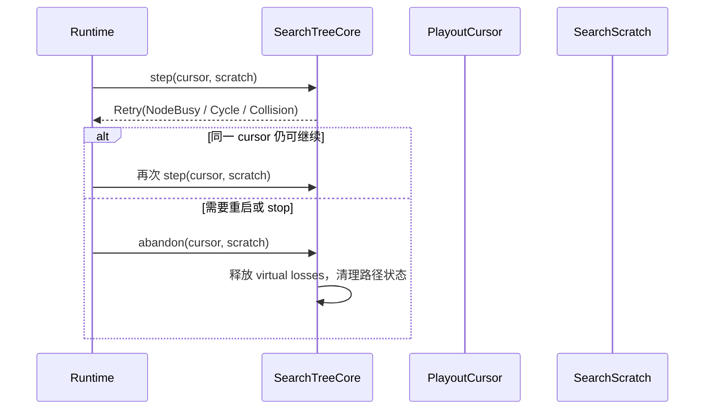
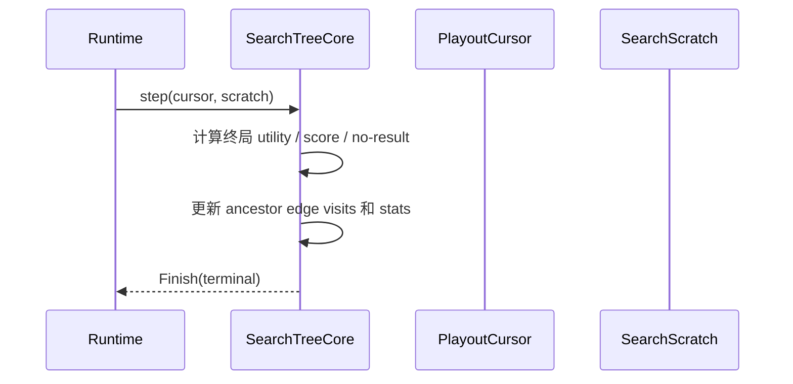

# SearchTreeCore

本文档定义 `SearchTreeCore` 模块的职责、类图、关键时序、不变量和迁移方式。

## 1. 模块目标

`SearchTreeCore` 的唯一职责是维护搜索树语义，不负责：

- 线程池
- coroutine 生命周期
- sender / receiver
- TensorRT slot / batch / stream
- NN 请求提交

它负责的内容与当前代码中的以下逻辑一一对应：

- 路径选择与 child 扩展
- virtual loss
- edge visit / child visit 关系
- graph search 一致性
- terminal/no-result 叶子处理
- NN eval 回填后的统计更新

当前代码锚点：

- `cpp/search/search.cpp`
- `cpp/search/searchnode.h`
- `cpp/search/searchexplorehelpers.cpp`
- `cpp/search/searchupdatehelpers.cpp`
- `cpp/search/searchnnhelpers.cpp`

## 2. 边界与非目标

### 2.1 公共边界

`SearchTreeCore` 只暴露同步 API：

- `begin_playout()`
- `step()`
- `apply_eval()`
- `abandon()`

### 2.2 非目标

- 不把 `SearchNode` 改造成 actor 或 coroutine。
- 不让 `SearchTreeCore` 直接持有 `NNEvaluator` / `NNRequestLayer`。
- 不在本模块里定义 sender completion 或 operation state。
- 不把 DemandController 的控制逻辑掺入树推进 API。

## 3. 关键类型

### 3.1 `SearchScratch`

这是可复用的 playout 工作缓冲，来源于当前 `SearchThread` 中真正与线程身份无关的部分。

建议字段：

- `Player pla`
- `Board board`
- `BoardHistory history`
- `Hash128 graphHash`
- `std::unordered_set<SearchNode*> graphPath`
- `Rand rand`
- `std::vector<MoreNodeStats> statsBuf`
- 调试 / 统计缓冲

它不持有：

- OS thread id
- scheduler
- stop token
- NN completion 状态

### 3.2 `PlayoutCursor`

`PlayoutCursor` 是一次 in-flight playout 的 move-only RAII 对象。

它负责持有：

- 当前路径 frame 栈
- 已经加上的 virtual losses
- 当前待评估叶子的稳定引用
- 本次 playout 是否计数
- 本次 playout 是否已经完成 / 放弃

设计要求：

- move-only
- 析构时若仍未完成，必须释放尚未归还的 virtual losses
- 不允许跨 session 使用

### 3.3 `PlayoutStep`

推荐定义：

```text
Continue
NeedEval { FeatureSpec feature_spec, bool allow_cache }
Retry { RetryReason reason, bool should_yield }
Finish { PlayoutTerminal terminal }
```

解释：

- `Continue`
  - 本次 `step()` 只推进了有限 CPU 工作量，允许 runtime 决定是否继续或先 yield。
- `NeedEval`
  - 已经锁定需要 NN 的 frontier；`PlayoutCursor` 内部仍持有该叶子上下文。
- `Retry`
  - 本次尝试没有产出 eval frontier，也没有产生终局值，需要 runtime 做退避或重启。
- `Finish`
  - 已经形成终局回填，不再需要 NN。

### 3.4 `FeatureSpec`

`FeatureSpec` 是 `SearchTreeCore -> NNRequestLayer` 的纯值描述，建议只包含：

- `bool include_owner_map`
- `int board_x_size`
- `int board_y_size`
- `int symmetry_hint`
- `float policy_optimism`
- 与 root / leaf 后处理直接相关的 flags

它不包含：

- host staging buffer 指针
- TensorRT slot / batch id
- continuation handle

### 3.5 `PlayoutTerminal`

建议枚举：

- `GameEndWinLoss`
- `GameEndNoResult`
- `EdgeVisitCatchUp`
- `IllegalMoveReinitialized`
- `CycleDetected`

这里不是为了向外报告完整业务语义，而是为了：

- 统一统计
- 为 `DemandController` / 观测系统提供 playout outcome 分类

## 4. 公共接口草案

```text
class SearchTreeCore {
 public:
  PlayoutCursor begin_playout(SearchScratch& scratch) const;
  PlayoutStep step(PlayoutCursor& cursor, SearchScratch& scratch);
  void apply_eval(PlayoutCursor& cursor, SearchScratch& scratch, NNEvalResult&& result);
  void abandon(PlayoutCursor& cursor, SearchScratch& scratch) noexcept;
};
```

契约：

- `begin_playout()` 重置 scratch 到 root 视图，并建立 cursor。
- `step()` 每次只消耗有限 CPU 工作量，以便 runtime 插入公平 yield 点。
- `NeedEval` 之后只能接 `apply_eval()` 或 `abandon()`。
- `apply_eval()` 执行当前 playout 的 leaf 回填，并结束该 cursor。
- `Finish` 表示 playout 已在树内完成，之后只能销毁或 move 掉 cursor。

## 5. 类图



## 6. 关键时序

### 6.1 正常 descent 到 `NeedEval`



### 6.2 `NeedEval` 之后回填



### 6.3 `Retry` 与放弃



### 6.4 terminal / no-result 完成



## 7. 核心不变量

### 7.1 路径与 virtual loss

- `PlayoutCursor` 是路径上 virtual loss 的唯一所有者。
- 每个 path frame 必须明确记录自己是否持有该 child 的 virtual loss。
- `apply_eval()`、`Finish` 路径、`abandon()` 路径必须都把持有关系归零。
- 不允许把 virtual loss 的归还依赖于调用方记忆。

### 7.2 frontier 生命周期

- `NeedEval` 返回后，frontier 叶子的身份只能存在于 `PlayoutCursor` 内部。
- `FeatureSpec` 可以复制，frontier 句柄不可以复制。
- `NNRequest` 不能反向引用 cursor。

### 7.3 图搜索一致性

- `graphPath` 必须属于一次 playout 尝试，而不是某个 worker 线程。
- cycle 检测命中时，必须在同一个 `step()` 内决定：
  - 是否计 edge visit
  - 是否把本次尝试记为 `Retry` 还是 `Finish`

### 7.4 与调度解耦

- `SearchTreeCore` 可以要求“调用方以后再来”，但不能说“在哪个线程再来”。
- `RetryReason` 只表达树语义或局部资源冲突，不表达 scheduler 细节。

## 8. 与当前代码的直接映射

| 当前函数 / 对象 | 新归属 |
| --- | --- |
| `Search::runSinglePlayout()` | `begin_playout()` 外层壳逻辑 |
| `Search::playoutDescend()` | `step()` 主体 |
| `Search::maybeCatchUpEdgeVisits()` | `step()` 内部辅助 |
| `Search::updateStatsAfterPlayout()` | `apply_eval()` / terminal 完成路径 |
| `Search::allocateOrFindNode()` | `step()` 内部辅助 |
| `SearchThread::graphPath` | `SearchScratch::graphPath` |
| `SearchThread::statsBuf` | `SearchScratch::statsBuf` |

## 9. 建议实现顺序

### 9.1 第一步

- 先引入 `SearchScratch` 和 `PlayoutCursor`。
- 在现有线程循环里调用 `begin_playout()/step()/apply_eval()`，不引入 coroutine。

### 9.2 第二步

- 把 `playoutDescend()` 的递归逻辑改成 cursor 驱动的显式状态机。
- 每次 `step()` 限制 CPU 工作量，使 runtime 后续可以插入 `yield()`。

### 9.3 第三步

- 把 `initNodeNNOutput()` 中直接调用 `nnEvaluator->evaluate()` 的部分完全移出模块。
- `SearchTreeCore` 只保留：
  - 何时需要 eval
  - eval 回来后如何应用

## 10. 测试与验证

至少需要以下测试：

- 单线程 playout 与旧实现逐步对比：
  - child 选择
  - edge visits
  - virtual losses
  - terminal/no-result 回填
- graph search / cycle 行为回归
- cursor 异常析构时 virtual loss 不泄漏
- `NeedEval -> apply_eval()` 前后统计一致性
- `Retry` / `abandon()` 不会错误增加 playout 计数

