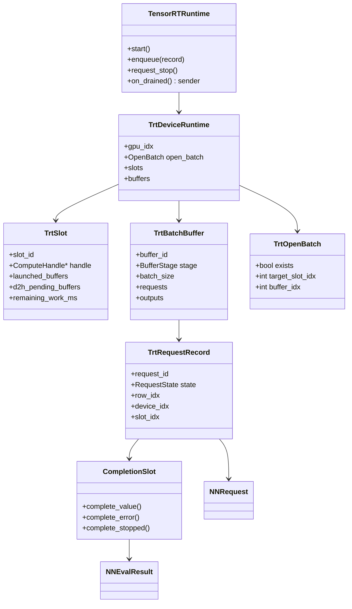
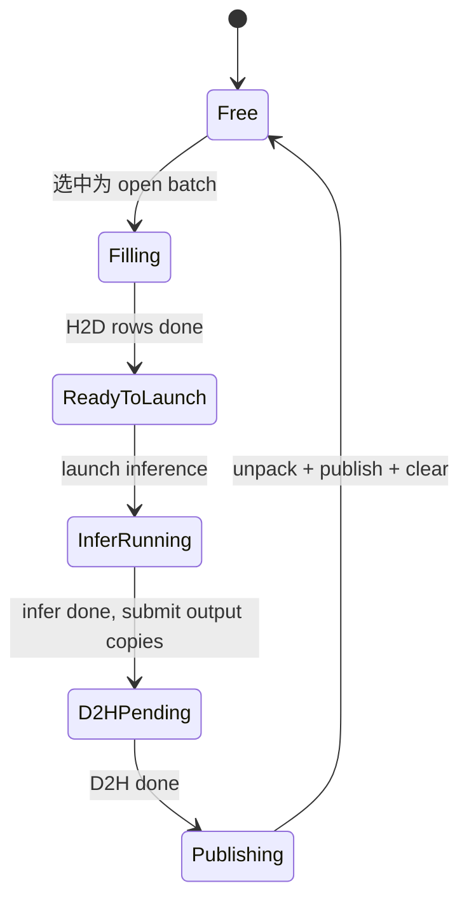
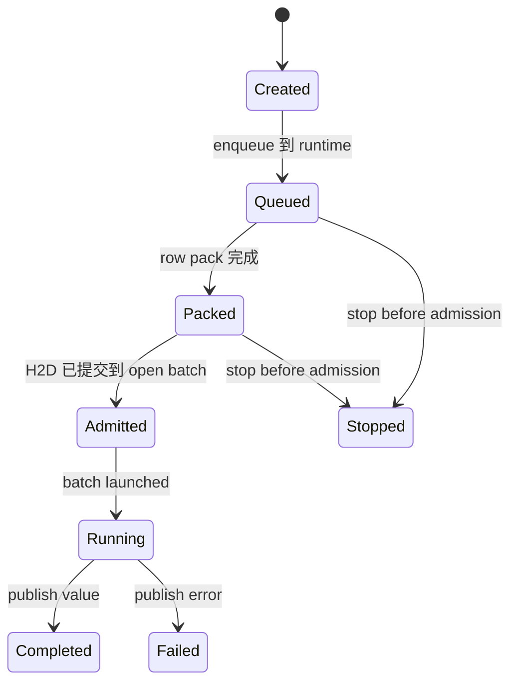
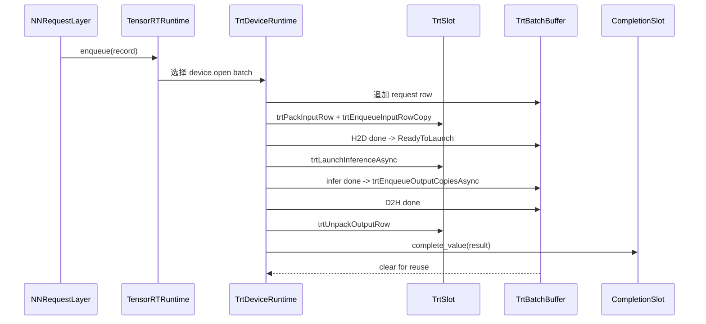
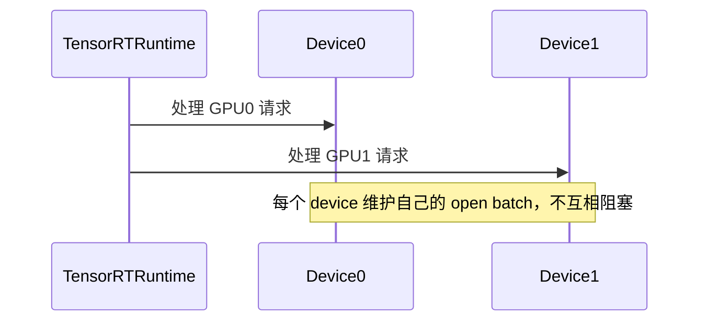
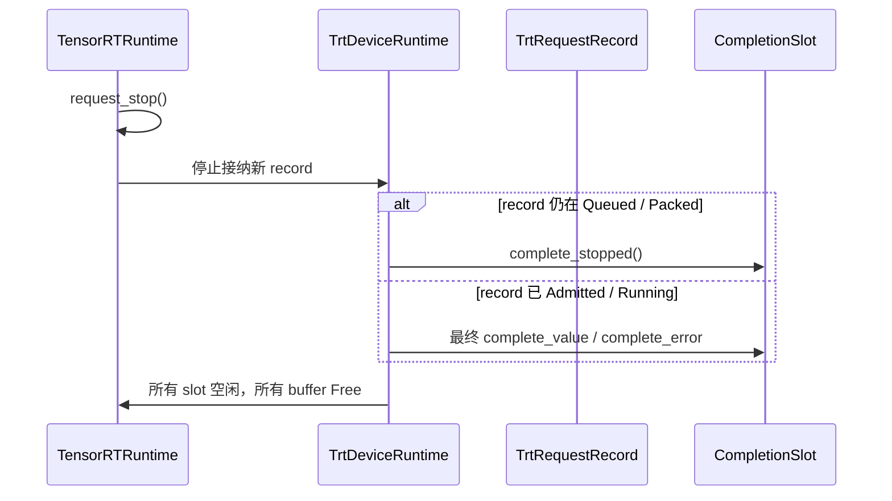
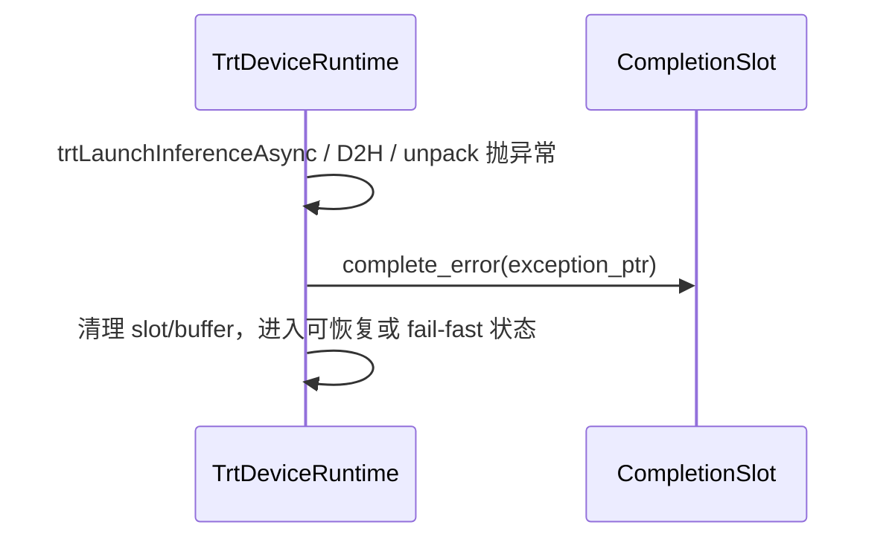

# TensorRTRuntime

本文档定义 `TensorRTRuntime` 模块的职责、内部对象、状态机、关键时序和迁移顺序。

## 1. 模块目标

`TensorRTRuntime` 只负责 TensorRT 专属执行：

- request 接纳
- slot / device / buffer 生命周期
- H2D / infer / D2H 提交与轮询
- row pack / output unpack
- 将 backend 完成事件路由给 `NNRequestLayer` 内部 completion adapter

它不负责：

- 搜索树推进
- playout task 生命周期
- cache 策略
- scheduler 公共协议设计

当前代码锚点：

- `cpp/neuralnet/nneval.cpp` 中 `SchedulerState` 与 `serveTrtScheduler`
- `cpp/neuralnet/trtbackend.cpp`
- `cpp/neuralnet/nninterface.h`

## 2. 线程模型

### 2.1 控制线程

Phase 1 建议保持一个专用 host 控制线程：

- 独占管理 TensorRT runtime 的内部状态机
- 轮询 H2D / infer / D2H 完成事件
- 为每个 slot 维护唯一的 `ComputeHandle`

理由：

- `ComputeHandle` 当前本身就是单线程使用约束
- 现有 `trtbackend.cpp` 的 shared-buffer 注册、流和 event 使用方式天然偏向单线程控制
- 这样可以最大化复用当前 backend 代码

### 2.2 多 GPU

目标结构是：

- 一个 `TensorRTRuntime`
- 多个 `TrtDeviceRuntime`
- 每个 device 下多个 `TrtSlot`
- 每个 device 自己维护 `OpenBatch`

这比当前全局单 `OpenBatchState` 更适合多 GPU 扩展。

## 3. 核心对象

### 3.1 `TensorRTRuntime`

职责：

- 持有控制线程
- 持有 per-device runtime 集合
- 接收 `TrtRequestRecord`
- 协调 stop / drain

### 3.2 `TrtDeviceRuntime`

建议字段：

- `int gpu_idx`
- `std::vector<TrtSlot> slots`
- `std::vector<TrtBatchBuffer> buffers`
- `TrtOpenBatch open_batch`
- `std::vector<double> base_work_ms_by_batch`

### 3.3 `TrtSlot`

建议字段：

- `int slot_id`
- `ComputeHandle* handle`
- `std::vector<int> launched_buffers`
- `std::vector<int> d2h_pending_buffers`
- `double remaining_work_ms`
- `bool is_using_fp16`

约束：

- 一个 slot 只由控制线程访问。
- 一个 slot 对应一个唯一 `ComputeHandle`。

### 3.4 `TrtBatchBuffer`

建议字段：

- `int buffer_id`
- `NNServerBuf* server_buf`
- `BufferStage stage`
- `int batch_size`
- `std::vector<TrtRequestRecord*> requests`
- `std::vector<NNOutput*> outputs`

### 3.5 `TrtRequestRecord`

这是 request layer 进入 backend 的内部记录，建议字段：

- `uint64_t request_id`
- `NNRequest request`
- `CompletionSlot* completion`
- `RequestState state`
- `int row_idx`
- `int device_idx`
- `int slot_idx`
- 调试 / 计时字段

### 3.6 `CompletionSlot`

这是 backend 和 request layer 的私有衔接点。

建议接口：

```text
struct CompletionSlot {
  void complete_value(NNEvalResult&&);
  void complete_error(std::exception_ptr);
  void complete_stopped();
};
```

强调：

- 这不是系统公共 abstraction
- 这只是 sender 私有 opstate 的 backend-facing adapter

## 4. 类图



## 5. 状态机

### 5.1 `TrtBatchBuffer` 状态



### 5.2 `TrtRequestRecord` 状态



约束：

- 一旦进入 `Admitted`，就不再承诺能 `set_stopped()`。

## 6. 关键时序

### 6.1 enqueue 到最终 publish



### 6.2 per-device open batch



### 6.3 stop 与 drain



### 6.4 backend 错误



## 7. 核心不变量

### 7.1 handle / stream 亲和性

- 一个 `ComputeHandle` 只属于一个 `TrtSlot`。
- 只有控制线程可以调用该 handle 上的 TensorRT / CUDA API。

### 7.2 shared buffer 生命周期

- 每个 `TrtBatchBuffer` 拥有自己的 `InputBuffers` / `NNServerBuf`。
- 初始化顺序：
  - `trtInitializeSharedBuffer`
  - `trtRegisterSharedBuffer` 到该 device 的每个 slot
- 销毁顺序必须与当前实现一致：
  - 先释放 handle
  - 后释放 buffer

### 7.3 admission 边界

- `Queued` / `Packed` 阶段仍可因 stop 被拒绝。
- 一旦 row 已经提交进入 open batch，record 视为 admitted。

### 7.4 backend-private fast path

允许存在：

- TensorRT 特化 row pack
- shared device buffer
- cudaGraph warmup / capture / replay
- per-batch base work ms 估计

但这些都必须被限制在 `TensorRTRuntime` 内部。

## 8. 与当前代码的映射

| 当前对象 / 逻辑 | v2 归属 |
| --- | --- |
| `SchedulerState::SlotState` | `TrtSlot` |
| `SchedulerState::BufferState` | `TrtBatchBuffer` |
| `SchedulerState::DeviceState` | `TrtDeviceRuntime` |
| `SchedulerState::OpenBatchState` | `TrtDeviceRuntime::open_batch` |
| `serveTrtScheduler()` | `TensorRTRuntime` 控制线程主循环 |
| `trtPackInputRow / trtLaunchInferenceAsync / trtUnpackOutputRow` | backend helper，继续保留 |

## 9. 实施顺序

### 9.1 第一步

- 先把现有 `SchedulerState` 逻辑从 `NNEvaluator` 中抽出，结构保持接近当前实现。
- 暂时保留单控制线程。

### 9.2 第二步

- 把全局 `OpenBatchState` 改成 per-device `open_batch`。
- 将 request record 和 completion adapter 接入 `NNRequestLayer`。

### 9.3 第三步

- 再评估是否需要更细的事件驱动或多控制线程设计。
- 在此之前不引入新的跨线程共享复杂度。

## 10. 测试与验证

- 单 GPU / 多 GPU 路径
- stop-before-admission / stop-after-admission
- shared buffer 注册与销毁顺序
- buffer 状态机无泄漏
- slot remaining work 估计不会负数失真
- 与旧 `serveTrtScheduler` 的吞吐和 batch 行为对比

